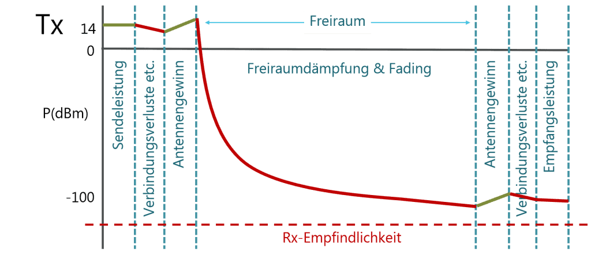
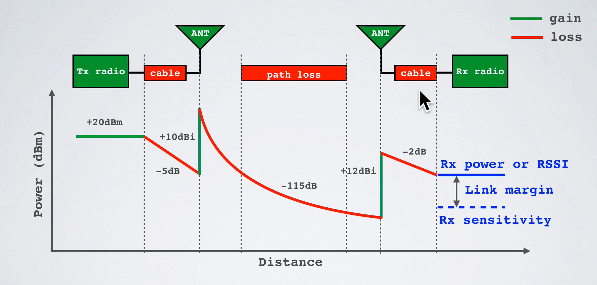

# Link Budget Hesaplaması

## HidroNode Tasarımı İçin Link Budget Hesaplaması

Oğuzhan ESEN tarafından hazırlandı.

---
# İçerik tablosu
- [Link Budget Hesaplaması](#link-budget-hesaplaması)
  - [HidroNode Tasarımı İçin Link Budget Hesaplaması](#hidronode-tasarımı-i̇çin-link-budget-hesaplaması)
- [İçerik tablosu](#i̇çerik-tablosu)
  - [1. Giriş](#1-giriş)
    - [1.1 Döküman Amacı](#11-döküman-amacı)
    - [1.2 Teknik Terimler](#12-teknik-terimler)
  - [2. Link Budget Nedir?](#2-link-budget-nedir)
    - [**2.1 Kazançlar**](#21-kazançlar)
      - [2.1.1 Gönderici Modül Çıkış Gücü (Transmitter Output Power):](#211-gönderici-modül-çıkış-gücü-transmitter-output-power)
      - [2.1.2 Verici Anten Kazancı (Transmitter Antenna Gain):](#212-verici-anten-kazancı-transmitter-antenna-gain)
      - [2.1.3 Alıcı Anten Kazancı (Receiver Antenna Gain):](#213-alıcı-anten-kazancı-receiver-antenna-gain)
      - [2.1.4 Alıcı Hassasiyeti (Receiver Sensitivity):](#214-alıcı-hassasiyeti-receiver-sensitivity)
    - [**2.2 Kayıplar**](#22-kayıplar)
      - [2.2.1 Serbest Uzay Kayıpları (Free Space Path Loss - FSPL)\*\*](#221-serbest-uzay-kayıpları-free-space-path-loss---fspl)
      - [2.2.1 Alıcı-Verici İletim Kaybı (Connector / Cable Loss):](#221-alıcı-verici-i̇letim-kaybı-connector--cable-loss)
      - [2.2.1 Atmosferik Kayıp (Atmospheric Loss):](#221-atmosferik-kayıp-atmospheric-loss)
      - [2.2.1 Polarizasyon Kaybı (Polarization Loss):](#221-polarizasyon-kaybı-polarization-loss)
  - [3. Link Budget Denklemi](#3-link-budget-denklemi)
    - [Tanımlar:](#tanımlar)
  - [4. HidroNode Link Budget Hesaplaması](#4-hidronode-link-budget-hesaplaması)

---
## 1. Giriş
RF uygulamalarında sinyal kalitesi çeşitli faktörler tarafından etkilenmektedir. Mesafenin önemli olduğu projelerde  sinyal kalitesinin ne derece etkilendiğinin bilimesi önemli bir parametredir.
 Mesafenin ve sinyal kalitesinin ne derece etkilendiğini hesaplamak için **Link budget** teriminin ne olduğunu ve hesaplamalarının nasıl yapıldığı bilinmesi gerekir.

 

### 1.1 Döküman Amacı
Bu yazının amacı; RF uygulamalarında mesafeyi etkileyen faktörleri, Link budget'ın ne olduğunu ve hesaplamalarının nasıl yapıldığını anlatmaktır.

### 1.2 Teknik Terimler

- **dBm (decibel-milliwatt):** 1 mW referansına göre ölçülen mutlak güç birimi.
- **dBi (decibel-isotropic):** İzotropik antene göre anten kazancını gösteren birim.    
- **dB (decibel):** İki değer arasındaki logaritmik oranı ifade eden birim.    
- **SUK (Serbest Uzay Kaybı / Free Space Path Loss, FSPL):** Mesafe ve frekanstan kaynaklanan serbest uzay kaybı.  
- **Alıcı Hassasiyeti (Receiver Sensitivity):** Alıcının algılayabildiği en düşük sinyal gücü.  
- **Link Margin (Bağlantı Marjı):** Alınan sinyal ile alıcı hassasiyeti arasındaki fark.  
- **RSSI (Received Signal Strength Indicator):** Alınan sinyalin gücünü gösteren ölçüm değeri.    
- **Gain (Kazanç):** Anten veya devrenin sinyali ne kadar güçlendirdiğini gösterir.  
- **Loss (Kayıp):** Kablo, filtre veya ortamda oluşan sinyal zayıflamasını ifade eder.  
- **Maximum Link Budget (Maksimum Bağlantı Bütçesi):** Sistemin izin verdiği en yüksek toplam güç bütçesi (verici gücü ile alıcı hassasiyeti arasındaki fark).  

## 2. Link Budget Nedir?
 Link Budget, bir radyo bağlantısında vericiden alıcıya giden sinyalin tüm **kazanç** ve **kayıplarının** toplamıdır. İletilen güç de kazanç olarak değerlendirilebilir.

$$
\text{Alınan Güç (dBm)} = \text{İletilen Güç (dBm)} + \text{Kazançlar (dB)} - \text{Kayıplar (dB)}
$$

Güç seviyeleri ( dBm ) cinsinden ifade edilir . Güç kazançları ve kayıpları desibel (dB) cinsinden ifade edilir .

---
### **2.1 Kazançlar**
#### 2.1.1 Gönderici Modül Çıkış Gücü (Transmitter Output Power):
  Bu, verici modülün antene ilettiği çıkış gücüdür ve genellikle LoRaWAN cihazlarında **14 dBm** olarak ayarlanır. Bu değer, RF sistemin başlangıç noktasındaki sinyal seviyesini belirler. Yasal düzenlemelere göre EU868 frekans bandında maksimum çıkış gücü 14 dBm ile sınırlıdır. Bu gücün üzerine çıkılırsa sistemin lisanssız çalışması yasal değildir.

#### 2.1.2 Verici Anten Kazancı (Transmitter Antenna Gain): 
  Antenin sinyali belirli bir yöne yoğunlaştırma yeteneğidir ve **dBi** cinsinden ifade edilir. Örneğin, küçük bir PCB antenin kazancı genellikle **+2 dBi** civarındadır. Bu kazanç sayesinde aynı çıkış gücüyle daha uzak mesafelere sinyal gönderilebilir. Anten ne kadar yönlü olursa kazancı o kadar artar, ancak kapsama açısı daralır.

#### 2.1.3 Alıcı Anten Kazancı (Receiver Antenna Gain):
  Alıcı tarafındaki antenin (örneğin gateway üzerinde) kazancını ifade eder. Bu da yine **+2 dBi** gibi değerlere sahip olabilir. Yüksek kazançlı antenler sinyali daha iyi alır, dolayısıyla iletişim kalitesini artırır. Ancak yönlü antenler yanlış yerleştirilirse sinyal kaybı da yaşanabilir.
#### 2.1.4 Alıcı Hassasiyeti (Receiver Sensitivity):  

  Alıcının algılayabildiği en düşük sinyal seviyesidir ve STM32WL serisi gibi LoRa destekli alıcılarda bu değer **–137 dBm**'e kadar inebilir. Kullanılan **Spreading Factor (SF)** ve **band genişliğine (BW)** bağlı olarak bu seviye değişkenlik gösterir. Örneğin SF12 ve 125 kHz bant genişliği kullanıldığında, STM32WL modülü (Semtech SX126x çekirdeğine sahip) **–137 dBm** gibi çok düşük sinyalleri dahi algılayabilir. Bu sayede zayıf ve uzak sinyallerle dahi kararlı bir haberleşme sağlanır. Ancak SF değeri küçüldükçe alıcı hassasiyeti düşer, buna karşılık veri hızı artar.

---
### **2.2 Kayıplar**  

#### 2.2.1 Serbest Uzay Kayıpları (Free Space Path Loss - FSPL)**

**Path loss**, gönderici ve alıcı antenler arasındaki ortamda meydana gelen sinyal zayıflamasıdır. Genellikle toplam kaybın en büyük bileşenidir ve çoğu zaman sistem tasarımında en belirsiz parametredir.

Farklı birim sistemlerine göre sabit ofsetler içeren yaklaşık FSPL ifadeleri:

- **Metre (distance) ve MHz (frekans)** kullanıldığında:

  $$
  L_{FS} \, \text{(dB)} \approx -27.55 + 20 \log_{10}(\text{frequency [MHz]}) + 20 \log_{10}(\text{distance [m]})
  $$

- **Kilometre (distance) ve MHz (frekans)** kullanıldığında:

  $$
  L_{FS} \, \text{(dB)} \approx 32.45 + 20 \log_{10}(\text{frequency [MHz]}) + 20 \log_{10}(\text{distance [km]})
  $$

- **Mil (distance) ve MHz (frekans)** kullanıldığında:

  $$
  L_{FS} \, \text{(dB)} \approx 36.6 + 20 \log_{10}(\text{frequency [MHz]}) + 20 \log_{10}(\text{distance [miles]})
  $$

#### 2.2.1 Alıcı-Verici İletim Kaybı (Connector / Cable Loss):
  Anten ile modül arasındaki iletim hattında (kablo, konektör, PCB izi) oluşan kayıplardır. Genellikle **0.5–2 dB** arasında olabilir. Özellikle düşük kaliteli veya uzun kablolar bu kaybı artırır.  

#### 2.2.1 Atmosferik Kayıp (Atmospheric Loss):
  Yüksek frekanslarda (GHz bandı ve üzeri) hava molekülleri (özellikle oksijen, su buharı) sinyalin zayıflamasına neden olur. LoRa gibi düşük frekanslı sistemlerde bu etki daha az dikkat edilebilir. Hava olaylarında (yağmur, dolu) bu kayıp artar.

#### 2.2.1 Polarizasyon Kaybı (Polarization Loss): 
  Verici ve alıcı antenlerin polarizasyon yönleri (dikey ↔ yatay) farklıysa, alınan sinyalde önemli zayıflamalar olabilir. Bu uyumsuzluk **3 dB’ye kadar** kayıp yaratabilir.  
  → İdeal durumda, hem verici hem de alıcı aynı yönde (örneğin ikisi de dikey) hizalanmalıdır.

  ---

  ## 3. Link Budget Denklemi

Kablosuz bir radyo iletim sistemi için temel etkileri içeren, logaritmik olarak ifade edilen bağlantı bütçesi denklemi aşağıdaki gibidir:

$$
P_{RX} = P_{TX} + G_{TX} - L_{TX} - L_{FS} - L_{M} + G_{RX} - L_{RX}
$$

### Tanımlar:

- **$P_{RX}$**: Alınan güç (dBm)  
- **$P_{TX}$**: Verici çıkış gücü (dBm)  
- **$G_{TX}$**: Verici anten kazancı (dBi)  
- **$L_{TX}$**: Verici kayıpları (koaksiyel kablo, konnektörler...) (dB)  
- **$L_{FS}$**: Yol kaybı / Serbest uzay kaybı (dB)  
- **$L_{M}$**: Çeşitli kayıplar (sönümleme marjı, gövde kaybı, polarizasyon uyumsuzluğu, diğer kayıplar...) (dB)  
- **$G_{RX}$**: Alıcı anten kazancı (dBi)  

Bu denlemde alınan güç değeri ($P_{RX}$), sistemin çalışabilirliğini belirler. Bu değerin alıcının minimum duyarlılığından (Receiver Sensitivity) yüksek olması gerekir. 

- **$P_{RX} > \text{Receiver Sensitivity}$** - Sistem çalışır, sinyal yeterlidir.  
- **$P_{RX} \approx \text{Receiver Sensitivity}$** - Sınırda çalışır, kopma riski yüksektir. (Maksimum mesafe )  
- **$P_{RX} < \text{Receiver Sensitivity}$** - Sinyal yetersiz, bağlantı kurulamaz.

---

## 4. HidroNode Link Budget Hesaplaması

- Frekans: **868 MHz**
- Mesafe: **2 km**
- Serbest uzay kaybı (FSPL): **97.2310** **$L_{FS}$**
- Atmosferik kayıp: **3 dB** **$L_{M}$**
- Polarizasyon kaybı: **3 dB** **$L_{M}$**   
- Toplam RX-TX anten kayıpları **10 dB**  **$L_{RX}$**  **$G_{TX}$**
- Gönderici Modül Çıkış Gücü: **14 dbm** **$P_{TX}$**
- Anten kazançları: **G_TX = +14 dBi**, **G_RX = +14 dBi** (yüksek kazançlı, yönlü) **$G_{TX}$** **$G_{RX}$**

$$
P_{RX} = 14 + (14 + 14) - 10 - 97.2310 - 6
$$

$$
P_{RX} = 14 + 28 - 10 - 97.2310 - 6
$$

$$
P_{RX} = -71.231 \, \text{dBm}
$$

STM32WL için tipik alıcı hassasiyetleri:
- SF12 @ 125 kHz → **−137 dBm**

- LM(SF12) = −71.231 − (−137) = **58.769 dB**

Bu durumda sistemde **çok yüksek bir link margin** vardır. Bu, 2 km mesafede bile sinyalin fazlasıyla yeterli olduğunu ve haberleşmenin sağlam şekilde gerçekleşeceğini gösterir.

---

